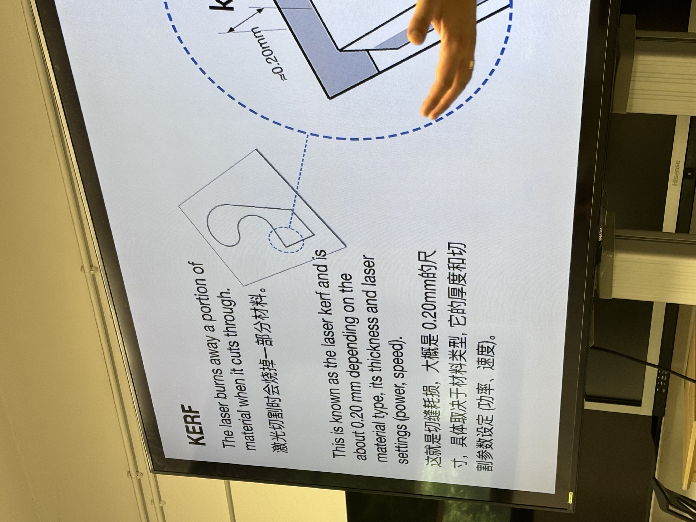
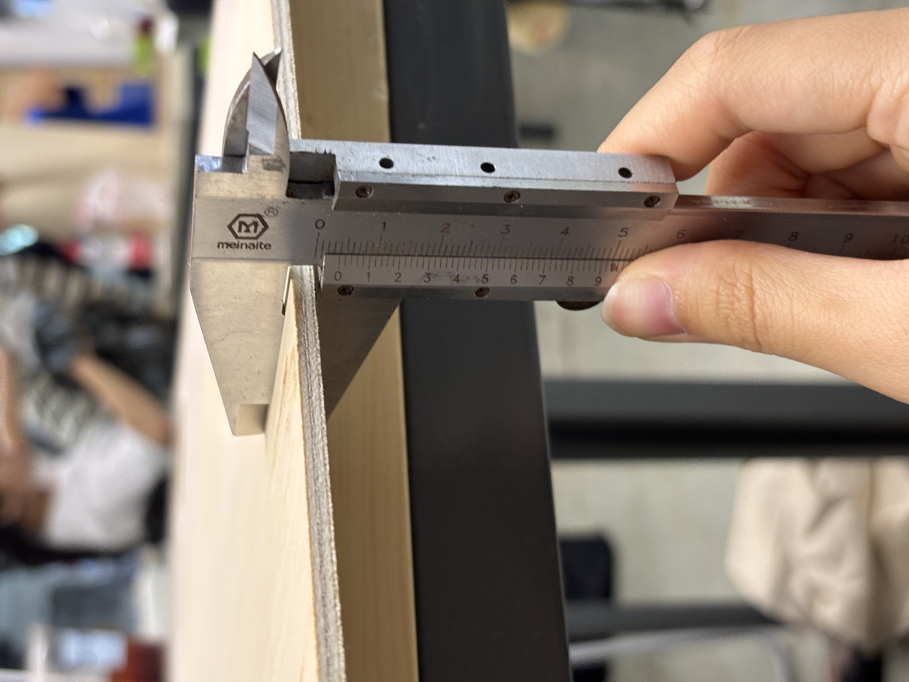
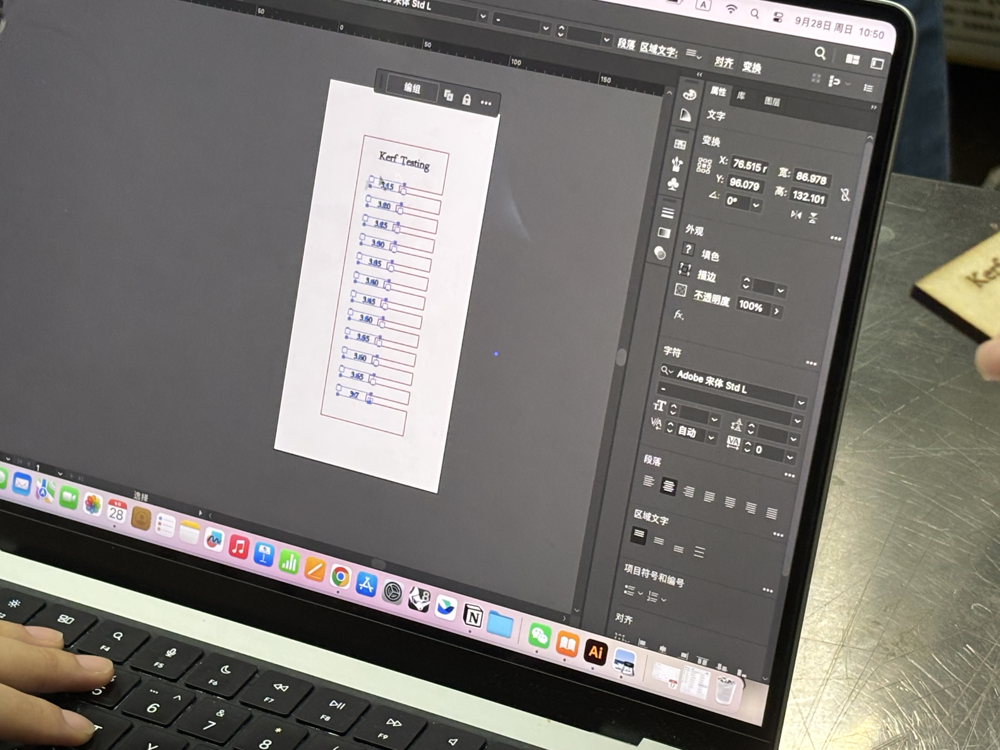
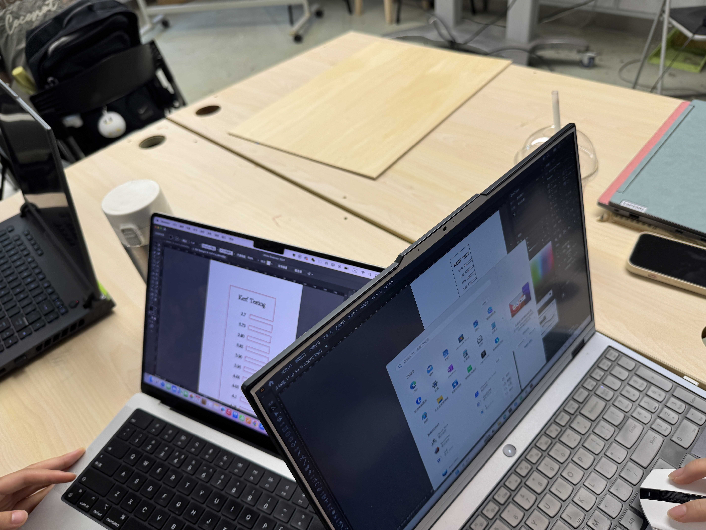
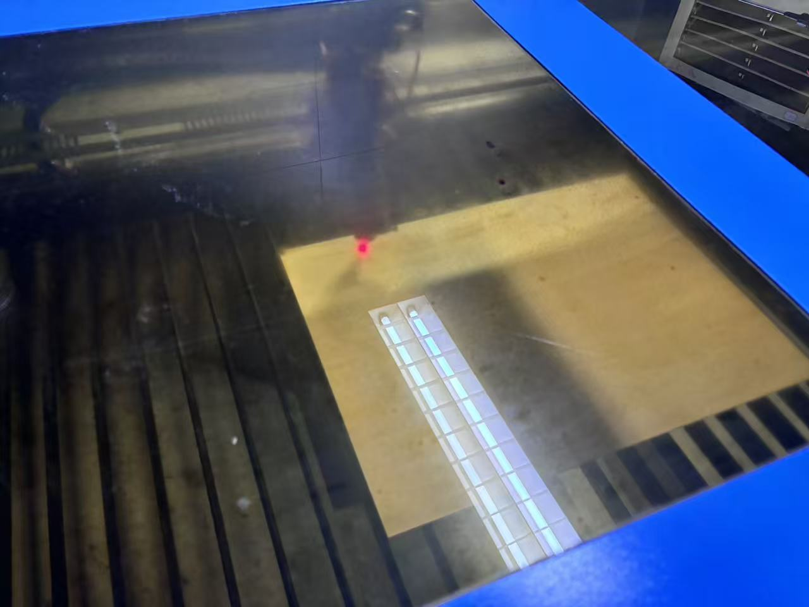
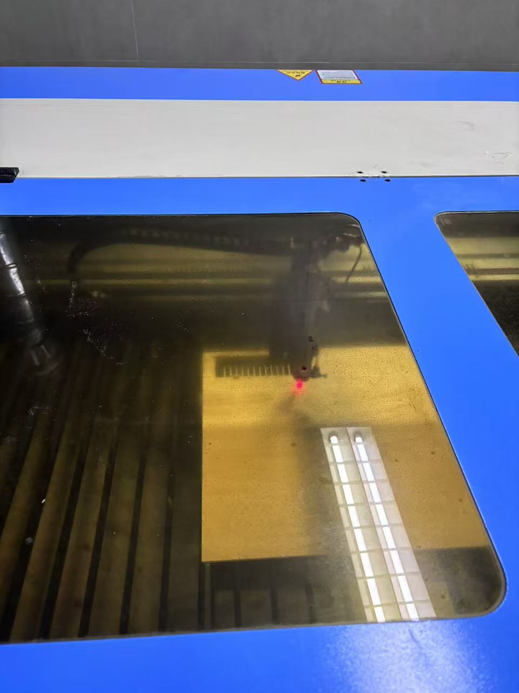
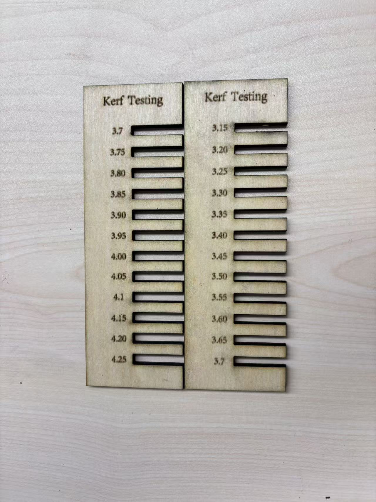
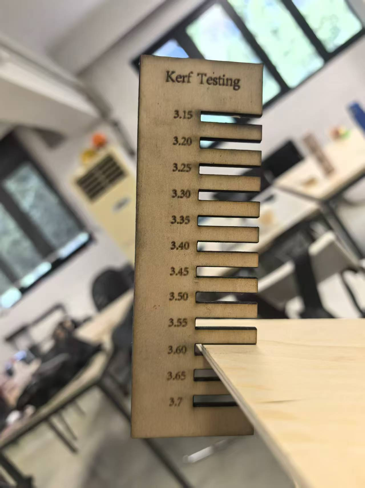

# Laser Cutting
## 1 Task
During class, we carried out laser cutting. The task, organized in groups, was to make a ruler to measure the specific material loss caused by laser cutting.

在课上进行激光切割，任务是以小组为单位，制作一个标尺，用来测量激光切割的具体损耗。

Explanation of “KERF” in the PPT.

## 2 Measurement and Drawing
At first, we measured the thickness of the wooden board using a vernier caliper, and the result was 4 mm.So our group began the production process, first using Adobe Illustrator to draw a vector graphic, so that it could be opened in “Laser CAD”.We set the values to start from 3.70 and increase step by step by 0.05 up to 4.25.

最开始我们使用游标卡尺对于木板厚度进行测量，结果是4mm。于是我们小组开始制作，先是使用adobe的ai绘制矢量图，以便于可以在“laser CAD”中打开。我们设置从3.70开始每0.05一个梯度逐次增加至4.25。

Measuring the thickness of the wooden board using a vernier caliper.

The process of creating the file.

## 3 First Laser Cutting
Next, our group went to the laser cutting area on the first floor to work. With the teacher’s help, we modified the file to make it suitable for the laser engraving machine. We placed the wooden board into the machine and prepared for focusing, positioning, and tracing the outline. It is important to note that the exhaust fan must be turned on! Ventilation helps reduce harmful gases generated during laser cutting. During our first cut, we forgot to turn it on and only did so after the teacher’s reminder.

接着，我们小组到一楼激光切割区域进行工作。在老师的帮助下，我们改动文件以适应激光雕刻机。将木板放入机器，进行对焦、定位、走边框的准备工作。值得注意的是，要开启排风扇！排风可以减少激光切割中产生的不良气体。第一次切割时我们忘记开了，经过老师提醒才开启。

Diagram of the laser cutting process.

## 4 Second Laser Cutting
But we soon discovered a problem. None of the slots fit the wooden board perfectly. Each one was slightly too large, even the smallest at 3.7 mm. The teacher realized that our measurement of the board’s thickness was not accurate enough. The actual thickness of the board was 3.74 mm, and our measurement had been too high. We immediately decided to remake the ruler, changing the measurement range from “3.7 mm–4.25 mm” to “3.15 mm–3.7 mm,” and performed laser cutting again. This time, the result was very good—3.6 mm fit the board perfectly.

但很快我们发现了一个不妙的事情。每一个插孔都无法完美契合木板。每一个都偏大，即使是最小的3.7mm。老师发现是我们对于木板厚度的测量不够准确。木板厚度的准确值是3.74mm，我们测量偏大。于是我们立马决定重新制作一个标尺，将测量范围从“3.7mm-4.25mm”改为“3.15mm-3.7mm”。再次进行激光切割。这次切割出来的结果很好，3.6mm一档可以完美契合木板。

Finished product.

## 5 Summary and Reflection
The teacher raised a question: the edges of the wooden board were slightly burnt. This could be due to the power being too high or the cutting speed being too slow. He suggested an improvement: we could try different settings, with the optimal condition being as fast as possible while using the minimum necessary power.

老师提出了一个问题，木板的边缘有一些烧焦。这可能是功率太强或者速度太慢的原因。并给我们提出改良方案：可以尝试不同设置，最佳状态是尽可能快且使用最低限度的电力。
